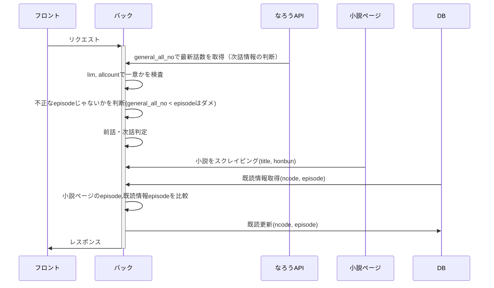

# 本文取得API

| メソッド | パス |
| --- | --- |
| get | /api/maintext |

## シーケンス図



## request

説明

| 項目名 | 型 | 概要 |
| --- | --- | --- |
| ncode | str | 小説のID |
| episode | int | 話数 |

```json
{
	"ncode": "n0902ip",
	"episode": 2
}
```

※ 短編は `episode` を固定で1にする

## response

説明

| 項目名 | 型 | 概要 |
| --- | --- | --- |
| title | str | タイトル |
| sub_title | str | 各話のタイトル |
| main_text | array(str) | 本文 |
| prev | boolean | 前話情報 |
| next | boolean | 次話情報 |

```json
{
	"title": "タイトル",
  "sub_title": "各話のタイトル",
	"main_text": ["家族とは何か。", "", "\u3000姉妹とはどんな存在なのか。"],
	"prev": True,
	"next": True,
}
```

textの保持方法

`split` を利用して配列として保持する

```python
a = "家族とは何か。\n\n　姉妹とはどんな存在なのか。\n\n　人によって解釈は違うし、家庭によって在り方も違うと思う。\n\n　仲睦まじい姉妹だっているだろう。\n\n　ただ、私にとっては幻想でしかなかった。\n\n　少なくとも"
print(a.split("\n"))
# -> ['家族とは何か。', '', '\u3000姉妹とはどんな存在なのか。', '', '\u3000人によって解釈は違うし、家庭によって在り方も違うと思う。', '', '\u3000仲睦まじい姉妹だっているだろう。', '', '\u3000ただ、私にとっては幻想でしかなかった。', '', '\u3000少なくとも']
```


## 考慮事項

- 短編小説のprev, nextは固定でfalse
- なろうAPIに投げるときncodeを条件として検索する
    - ncode以外で検索すると一意に絞れないため
- 存在しないncodeで検索されるときの対策

    - 条件にlim（最大出力数）を1に設定
        
    - 出力の allcount (全作品出力数)が1であることを確認
        
- ofパラメータで指定するものは ”t-ga” (タイトル、全話数)の2つのみ
    - ncodeは引数で持つので不要
