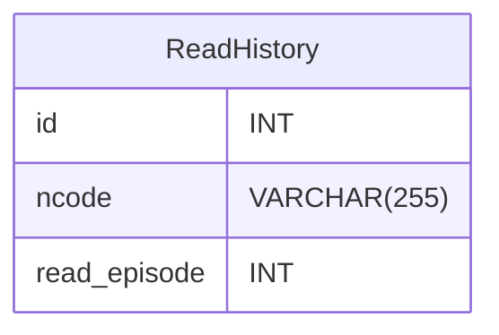

---
# https://vitepress.dev/reference/default-theme-config
layout: doc
title: DB仕様書
next: false
prev: false
---

# ER図

## Table定義
| 物理名 | 論理名 | PK/FK | NULL | データ型 |デフォルト| 備考|
| --- | --- | --- | --- | --- | --- | --- |
| id | ID | PK | FALSE | INT | ||
| ncode | 小説コード | | FALSE | VARCHAR(255) |||
| read_episode | 既読した話数 | | FALSE | INT | 0 ||