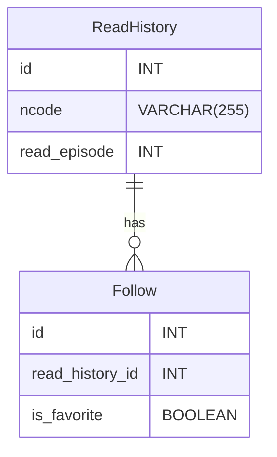

---
# https://vitepress.dev/reference/default-theme-config
layout: doc
title: DB仕様書
next: false
prev: false
---

# ER図

## Table定義
### ReadHistory(既読テーブル)
| 物理名 | 論理名 | PK/FK | NULL | データ型 |デフォルト| 備考|
| --- | --- | --- | --- | --- | --- | --- |
| id | ID | PK | FALSE | INT | ||
| ncode | 小説コード | | FALSE | VARCHAR(255) |||
| read_episode | 既読した話数 | | FALSE | INT | 0 ||

### Follow(お気に入りテーブル)
| 物理名 | 論理名 | PK/FK | NULL | データ型 |デフォルト| 備考|
| --- | --- | --- | --- | --- | --- | --- |
| id | ID | PK | FALSE | INT | ||
| read_history_id | 既読テーブル_ID | FK | FALSE | INT | ||
| is_favorite | お気に入り | | FALSE | BOOLEAN |False||