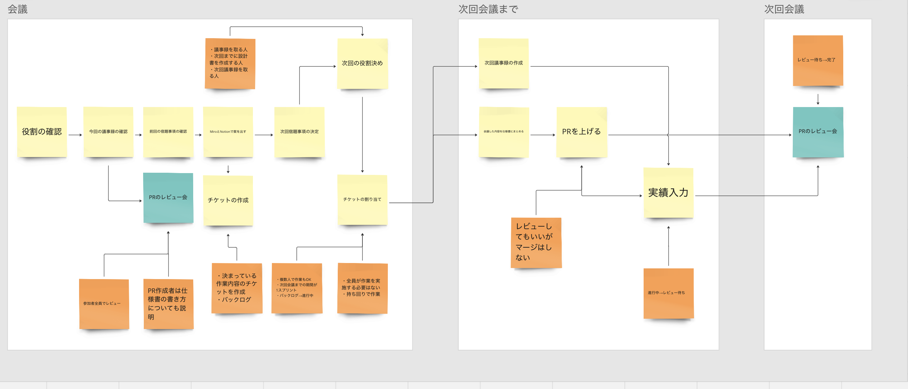

---
# https://vitepress.dev/reference/default-theme-config
layout: doc
title: 開発する際の決まり事
description: 開発時のルールを簡単にまとめたページ 
next: false
prev: false
---

# 開発する際の決まり事

## チケットについて
- **Notionは使用しない**
- チケットはGitHubProjectsで作成する
    - GitHubProjectsはレポジトリ横断でIssueを管理できる
    - GitHubRepositoryを用いて開発するのでProjects内で全てのチケットが見れるようになる
    - 一元管理できてかわちい🐶

## 進め方

**進め方miroのリンクは[コチラ](https://miro.com/app/board/uXjVNDsW97I=/?moveToWidget=3458764573091454755&cot=14)💁**

- 毎週火曜日21:00~23:00に定例会
- 定例会の内容
    - 宿題事項の確認
    - PRレビュー会
    - 案を出し合う
    - 次回宿題事項の決定
    - 次回の役割決め
    - チケットの割り当て
        - 次回定例会(1週間後)までに終わるチケットにする事！🕺

- 次回定例会までに済ませておく事
    - 議事録の作成
    - PRを上げる・宿題の消化
    - 実績入力

## 仕様書作成
- 基本的に1記事1PR
    - リンクを追加した分をセットで1PR